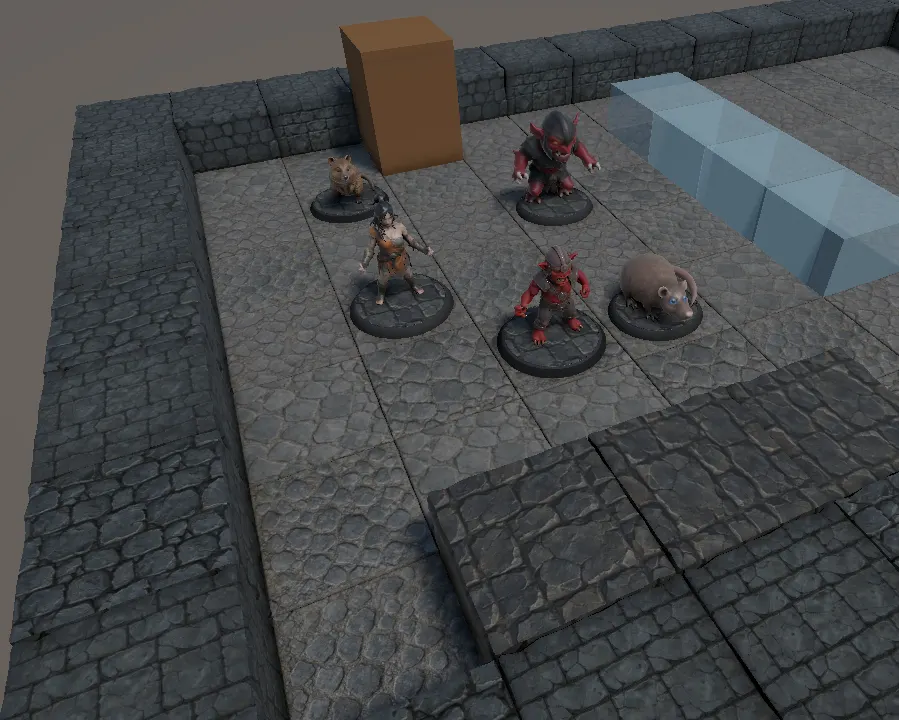
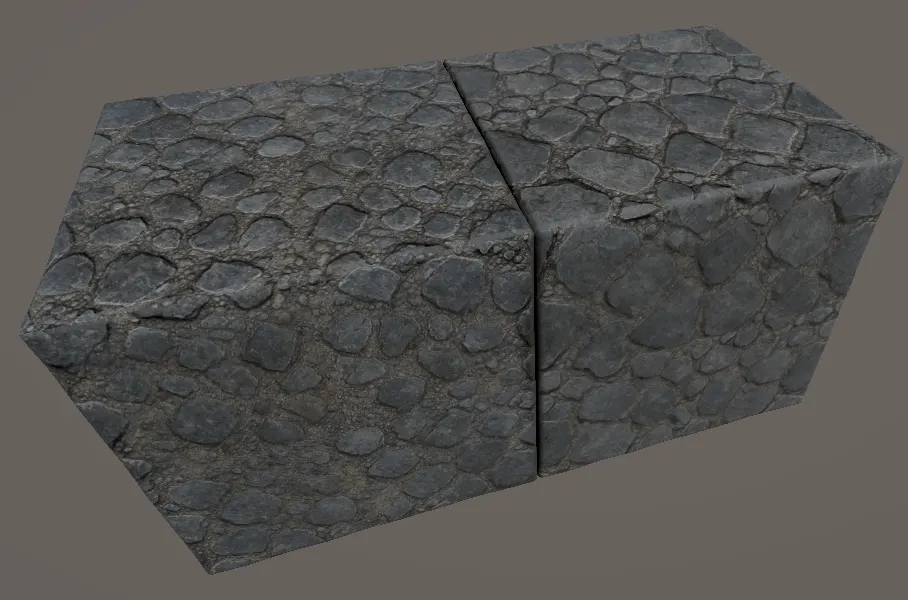
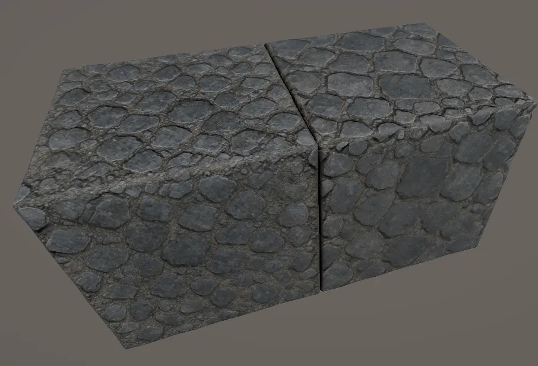

The terrain stopped being grey boxes this week: walls and floors are modelled,
chamfered on every edge, and each has a second variant. Which variant a cell gets
and how far it is turned comes from the cell itself, so a corridor does not
visibly repeat.

That is when the look fell apart. Neighbouring tiles carrying the same material
rendered at clearly different brightness. Four causes in the end, none of them
where I looked first, and the last only came into view once the others were gone.

## The bench could not show the problem

There is an editor scene for judging light, and for checking whether a run of
wall repeats. It placed the base prefab into every cell at zero rotation — no
variants, no turn. The one tool meant to show variety was the one place variety
did not happen, and had been since it was written.

Worse than useless, in a specific way: an unturned grid of identical tiles hides
a repeating texture rather than exposing it, because the eye reads the regularity
as deliberate. The bench now calls the same two functions the map does.

## The tones had drifted apart

| map | average sRGB | linear luminance | R−B |
| --- | --- | --- | --- |
| wall A | 43.5 / 47.0 / 45.8 | 0.030 | −2.3 |
| wall B | 50.8 / 56.5 / 58.1 | 0.042 | −7.3 |
| floor A | 91.5 / 88.1 / 81.3 | 0.101 | +10.2 |
| floor B | 82.0 / 79.5 / 73.0 | 0.081 | +9.0 |

Two problems sit in that table. The walls lean cool and the floors lean warm —
opposite signs on `R−B`, seventeen points apart — which is what made them read as
two different asset packs. Between the floors it is not hue at all: the multiplier
taking one to the other is `(0.796, 0.810, 0.804)`, three channels agreeing within
two percent. Same stone, one of them a fifth darker. Nothing else could have
caused it; all four materials share a shader, sit at smoothness 0.222 to 0.225,
and bind neither a gloss nor an occlusion map.

The correction went into the base colour, which was white everywhere and
therefore free — but not as `0.796`. The project renders in linear space while a
material colour is stored as sRGB, so the ratio has to be encoded first, and
`0.796` is written `0.904`. The raw figure would have darkened the tile about
twice as far as intended, and would have looked plausible doing it.

## The normal maps had a ramp baked in

Two tiles, same material, same texture, different contrast — and identical
whenever they happened to land on the same rotation. A tangent-space normal map
should average to a normal pointing straight up. These did not:

| map | average tilt | brighter, turned toward the light |
| --- | --- | --- |
| wall A | 5.0° | +13% |
| wall B | 12.3° | +36% |
| floor A | 10.2° | +29% |
| floor B | 9.7° | +27% |

That is not relief but a ramp built into the whole tile, all four leaning much
the same way. Turn the ramp toward the key light and the tile brightens; turn it
away and it darkens.

The cause is upstream. Ask an image generator for a normal map and it produces
one from a picture that already had directional lighting in it, so a lighting
gradient gets encoded as geometry. Asking instead for a grayscale height map and
letting the engine build the normal cannot carry the defect: direction comes from
the local slope, and across a tiling texture those slopes cancel.

## Fixing that uncovered an older bug

With the relief behaving, a hard line appeared across the middle of every block.
I looked at the height map first, and that was the wrong place. The UV islands
run from −0.5 to 0.5 across and 0.5 to 1.5 down — the right size, exactly one
texture per face, but centred on the corner of the texture instead of its middle.
So the point where the texture wraps falls through the centre of the face.

That had been true since the first export. What changed is that it became
visible, because none of these textures tile seamlessly:

| map | mismatch across | mismatch down |
| --- | --- | --- |
| wall A diffuse | 1.7× | 1.7× |
| floor A diffuse | 2.6× | 2.6× |
| floor A height | 3.9× | 3.6× |
| wall A normal | 4.5× | 3.6× |

Measured against how much two neighbouring rows inside the same image differ, so
1× would mean the opposite edges match as well as any two adjacent rows do.

A colour step of twenty levels out of 255 where the texture wraps is something
the eye forgives. The same step in a height map does not stay a step: building a
normal out of height means differentiating it, and the derivative of a step is a
spike. Twenty levels over one pixel becomes a cliff, and a cliff lit from the
side is a hard bright line.

The defect belongs to the model and gets fixed there, with the UV island shifted
half a texture on the next export. Until then the material's texture offset moves
the wrap out to the face edge, where the chamfer hides it.

## What this cost

A day, most of it spent looking rather than measuring. Each cause became obvious
the moment there was a number beside it, and each had survived weeks of being
looked at.

Three of the four defects were old. They surfaced this week only because fixing
one of them removed the noise the others were hiding behind — work that looks
like it is generating new problems is often work that is finally showing the
ones already there.
